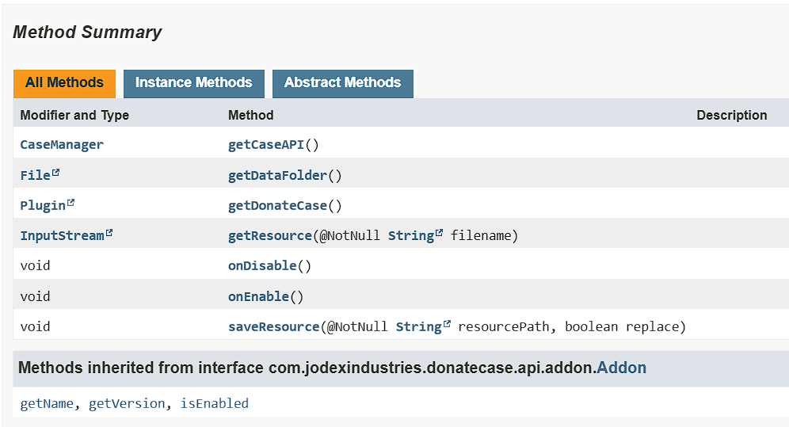

# DCEventManager Wiki
This addon allows you to manage DonateCase events.<br></br>
With it, you can perform certain actions, such as sending messages and executing commands on behalf of the console.
**How does it work?<br></br>**
The addon listens to all events that are registered in DonateCase.
Receiving events takes place with the help of reflection, which means that when you update DonateCase, new events will be automatically uploaded to DCEventManager, without the need to update the addon! <br></br>
## Example config.yml
```yml
Debug: false
Package: "com.jodexindustries.donatecase.api.events" # dont change this

Events:
  MyEvent:
    Event: AnimationStartEvent
    Actions:
      - "[command] say Animation started!"

  MyAnotherEvent:
    Event: AnimationEndEvent
    Actions:
      - "[broadcast] &dAnimation ended!"
```

## Events
> **List of all events available [here](https://repo.jodexindustries.xyz/javadoc/releases/com/jodexindustries/donatecase/DonateCaseAPI/2.2.5.8/raw/com/jodexindustries/donatecase/api/events/package-summary.html)**

## Actions
### [All DonateCase actions](../items-settings#actions)
### DCEventManager actions
#### Method invoke
Example
`- [invoke] setCancelled(true)`

## Case-Specific Support
Works only if event has `getCaseType` or `getCaseData` methods
```yaml
Events:
  MyEvent:
    Event: AnimationStartEvent # your event
    Case: case # here specific case
    Actions:
      - "[command] say Case opened!"
```

## Slot-Case-Specific Support
Works only if event has `getSlot` method
```yaml
Events:
  MyEvent:
    Event: CaseGuiClickEvent # your event
    Case: case # here specific case
    Slot: 1 # here specific slot
    Actions:
      - "[command] say Gui clicked!"
```

## Placeholders
DCEventManager has its own personal placeholder system that allows you to use **ALL** the methods that events provide.<br></br>
**This system works with the help of Reflection!**<br></br>

An example of a placeholders:
```yaml
Events:
  AddonDisableEvent: # event class name
    addon: # placeholder id
      placeholder: "%addon%" # replaced placeholder
      method: "getAddon#getName" # class method
    reason: # placeholder id
      placeholder: "%reason%" # replaced placeholder
      method: "getReason" # class method
    caused: # placeholder id
      placeholder: "%caused%" # replaced placeholder
      method: "getCaused#getName" # class method
```

If you don't understand programming, then it can look a little confusing, because of the `method` parameter.
But don't be disappointed, it's as simple as that! <br></br>
This parameter is used to determine where the placeholder value will be taken from. <br></br>

Let's take a look at the JavaDocs of the [AddonDisableEvent](https://repo.jodexindustries.xyz/javadoc/releases/com/jodexindustries/donatecase/DonateCaseAPI/2.2.5.8/raw/com/jodexindustries/donatecase/api/events/AddonDisableEvent.html#method-summary) class


Here we can see that the [AddonDisableEvent](https://repo.jodexindustries.xyz/javadoc/releases/com/jodexindustries/donatecase/DonateCaseAPI/2.2.5.8/raw/com/jodexindustries/donatecase/api/addon/internal/InternalAddon.html#method-summary) class has several interesting methods, such as: `getAddon`, `getCaused`, and `getReason` <br></br>
I think you've already guessed that these are the methods used to get placeholder values, but what is `#`? <br></br>
This is a symbol for separating methods. For example, we call the getAddon method, which is an [InternalAddon](https://repo.jodexindustries.xyz/javadoc/releases/com/jodexindustries/donatecase/DonateCaseAPI/2.2.5.8/raw/com/jodexindustries/donatecase/api/addon/internal/InternalAddon.html#method-summary) object that has the following methods:

Of course, it will be a little strange to just display information about some [InternalJavaAddon](https://repo.jodexindustries.xyz/javadoc/releases/com/jodexindustries/donatecase/DonateCaseAPI/2.2.5.8/raw/com/jodexindustries/donatecase/api/addon/internal/InternalAddon.html#method-summary) without additional instructions, but it is worth looking at what this class is and it looks like it represents the interface of an internal addon and we can take some useful information from it! Let's get the name of this addon, it seems that the [getName](https://repo.jodexindustries.xyz/javadoc/releases/com/jodexindustries/donatecase/DonateCaseAPI/2.2.5.8/raw/com/jodexindustries/donatecase/api/addon/Addon.html#getName()) method is just right for us! <br></br>
Well, now our method looks like this: `getAddon#getName`<br></br>

If you have any additional questions, please contact our [Discord server](https://discord.gg/2syNtcKcgR)!